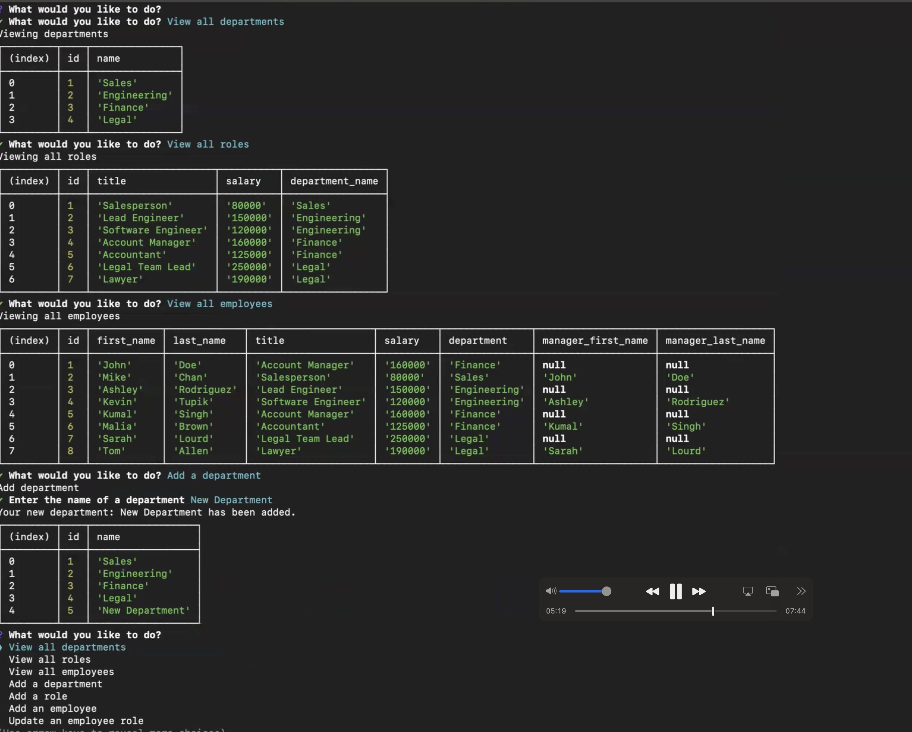

# Content Management System 

## Description

This application was created in order to make it easy to manage employees, roles and departments by simply submitting answers to a series of command line prompts.  It was created with Node.js and the Inquirer and pg packages and written in Javascript with TypeScript, utilizing PostgreSQL.  Inquirer will allow for the command line prompts.  The answers you provide to Inquirer will populate in the corresponding sections command line application and allow you to navigate through managers, roles and departments. 

### Video Demonstration
[Click here to watch the video demonstration](https://youtu.be/kmLvi4EJv2E)

## Table of Contents
- [Installation](#installation)
- [Usage](#usage)
- [License](#license)
- [Contributing](#contributing)
- [Tests](#tests)
- [Questions](#questions)

## Installation

After downloading or cloning this repo, make sure you have Node installed.  

Install the packages with ``npm install`` to pull in the dependencies as so: 
 "dependencies": {
    "dotenv": "^16.4.5",
    "inquirer": "^12.0.0",
    "pg": "^8.13.0"
  },
  "devDependencies": {
    "@types/inquirer": "^9.0.7",
    "@types/node": "^22.7.5",
    "@types/pg": "^8.11.10",
    "typescript": "^5.6.3".}

  Run the application with ``npm run dev``.  The scripts are these: 
    "scripts": {
    "build": "tsc",
    "start": "node dist/index.js",
    "dev": "tsc && node dist/index.js", 
    "test": "echo \"Error: no test specified\" && exit 1"
  },

## Usage

Create a new database in postgres called company_db by loading the schema.sql file to postgres. Then load the seeds.sql file.  

Begin by running ``npm run dev`` in the command line. Once you are prompted by Inquirer to answer the necessary questions, be ready to submit your answers.  

You can view all departments, roles and employees.  Then you can add new departments, roles and employees.  Lastly, you can update the role of existing employees.  

## License

MIT License

The license for this application is MIT License.

https://opensource.org/license/MIT

## Contributing

Contributors: 

Caryn Carter https://github.com/Caryndcarter 

To contribute, contact carter.caryn@gmail.com.

## Tests

Tests for this application have not been written at this time.  When they are written, they will be added in this section.  

## Questions

For questions visit https://github.com/caryndcarter or write to carter.caryn@gmail.com.

